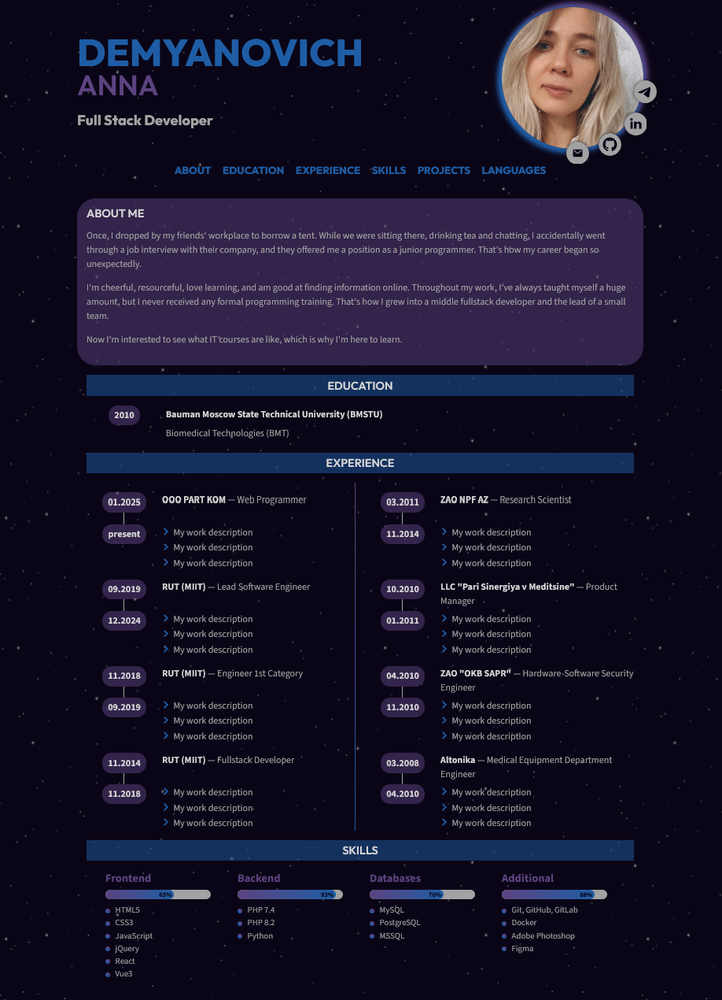

# Anna Demyanovich — CV / Portfolio

Semantic HTML & CSS curriculum vitae built for [RS School](https://rs.school/).

[](https://thefoxtale.github.io/rsschool-cv/)
[](https://thefoxtale.github.io/rsschool-cv/)
[](https://thefoxtale.github.io/rsschool-cv/)
[](https://rs.school/courses/javascript-ru)

## Live demo

- **HTML & CSS CV:** [https://thefoxtale.github.io/rsschool-cv/](https://thefoxtale.github.io/rsschool-cv/)
- **Markdown CV:** [https://thefoxtale.github.io/rsschool-cv/cv](https://thefoxtale.github.io/rsschool-cv/cv)

## Screenshot



## About

Personal CV page for **Anna Demyanovich**, Full Stack Developer.  
Dark “space” theme, semantic layout, local self-hosted fonts, and SVG social icons around the avatar.

## Features

- Semantic HTML5 landmarks (`header`, `main`, `footer`, `nav`, `section`, `article`)
- Accessible navigation with skip link and labeled social icons
- CSS custom properties for a centralized color & typography system
- Self-hosted fonts: **Outfit**, **Source Sans 3**, **JetBrains Mono** (no Google Fonts CDN)
- WebP project previews with `loading="lazy"`
- Smooth scrolling and back-to-top control
- Footer with GitHub link, year, and RS School logo

## Tech stack

| Area | Tools |
|------|--------|
| Markup | HTML5 |
| Styles | CSS3 (Flexbox, Grid, custom properties, masks) |
| Fonts | Outfit, Source Sans 3, JetBrains Mono (local `.woff2`) |
| Assets | SVG icons, WebP images |
| Deploy | GitHub Pages |

## Getting started

```bash
git clone https://github.com/theFoxTale/rsschool-cv.git
cd rsschool-cv
```

Open `index.html` in a browser, or serve locally:

```bash
npx serve .
```

Then visit the URL printed in the terminal (usually `http://localhost:3000`).

## Deployment (GitHub Actions → Pages)

Every push (including merges) to `main` triggers [`.github/workflows/deploy-pages.yml`](.github/workflows/deploy-pages.yml), which publishes the site to GitHub Pages.

### One-time repository setup

1. Open **Settings → Pages**
2. Under **Build and deployment → Source**, choose **GitHub Actions** (not “Deploy from a branch”)
3. Merge this workflow into `main`, or run it once via **Actions → Deploy to GitHub Pages → Run workflow**

After that, the live site updates automatically on each merge to `main`:  
https://thefoxtale.github.io/rsschool-cv/

## Project structure

```text
rsschool-cv/
├── .github/workflows/  # CI: deploy to GitHub Pages
├── index.html          # HTML/CSS CV
├── style.css           # Styles
├── cv.md               # Markdown CV
├── README.md
├── .gitignore
└── assets/
    ├── contacts/       # Social SVG icons
    ├── fonts/          # Local woff2 font files
    ├── img/            # Photo, logos, background
    ├── lists/          # List markers
    └── projects/       # Project preview images (WebP)
```

## RS School task

This repository follows the RS School **CV. HTML, CSS & Git Basics** assignment:

- Branch workflow: `rsschool-cv-html` → `gh-pages`
- Deployed via GitHub Pages
- Content in English

## Contact

- GitHub: [theFoxTale](https://github.com/theFoxTale)
- Telegram: [@annie_in_life](https://t.me/annie_in_life)
- Email: [makarenkoanna@yandex.ru](mailto:makarenkoanna@yandex.ru)

## License

Personal portfolio project for educational purposes (RS School).  
All rights reserved unless otherwise noted.
